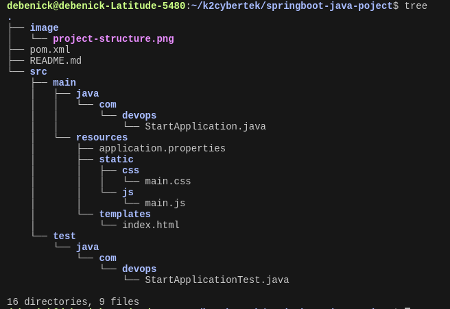

# Runbook for Hosting A Basic Maven Web App Project

## Good to know

- Maven is a powerful build automation tool used primarily for Java projects.
- The key file in maven is the `pom.xml` file (POM - Project Object Model) which manages the project settings and dependencies.
- Maven is crucial for DevOps because it helps in "**Automating Builds**", "**Managing Dependencies**", and "**Ensures Consistency in Builds**"

## Setting Up Maven

Prerequisite: Setup an Ubuntu AWS EC2 instance

### Installing Maven with Apt

Before installing maven we need to make sure we have Java 17 or greater installed in our Ubuntu instance.
Run the commands below to install Java 17 and check your installation

```
sudo apt-get update
sudo apt-get upgrade
sudo apt install openjdk-17-jdk openjdk-17-jre
java -version
```

You can install Maven on Ubuntu in a quick and easy way through the apt command. For this, you must follow these steps.

1. **Update the system repositories**: Open the terminal on Ubuntu and type the command `sudo apt update -y && sudo apt upgrade -y`

2. **Install Maven**: Install Maven on Ubuntu from the official repository using the command `sudo apt install maven -y`

3. **Verifying installation**: Verify the installation by checking Maven's current version with the command `mvn -version`

### Let's build a Basic Java Application

Let's setup a basic Java application using Maven. This project will cover creating a Maven project, managing dependencies, building the project, and running tests.

1. Go to your terminal and create a basic maven project by cloning it from a git repo as seen below

```
 git clone https://github.com/debenick17/springboot-java-poject.git

```

This command creates a new Maven project with a standard directory structure.

2. To understand the ideal project structure, run the `tree` command in the root of the project. If you don't have tree installed, run `sudo apt  install tree` to install tree. You'll see a high level structure like this: 

- `pom.xml`: The configuration file for your Maven project.
- `src/main/java`: Contains your application's source code.
- `src/test/java`: Contains your test code.

3. Now we can proceed with building the project with `mvn compile`. This command compiles your source code and stores the compiled files in the target/classes directory.

4. Make sure no test is failing with `mvn test`. Maven will compile and run the tests defined in _src/test/java_.

5. Time for packaging. To package your application into a JAR file, run `mvn package`. This will create a JAR file in the target directory. (You should check by listing the content of the generated "_target_" folder)

6. Let's talk about "mvn clean". The `mvn clean` command is used to remove all files generated by the previous build. This includes the "_target_" directory where Maven stores compiled classes, JAR files, and other build artifacts. Essentially, `mvn clean` helps to start your build from a fresh state, ensuring no remnants from previous builds interfere with the current one. Navigate to your Maven project directory, and run `mvn clean` then monitor the files and folders that will be deleted.

7. We can Clean and Package in one go. The `mvn clean package` command is a combination of two phases: "clean" and "package". It first executes the clean phase to remove any previous build artifacts and then proceeds to the package phase to compile your code, run tests, and package the application into its distributable format (e.g., a JAR or WAR file). To see that in practice, execute `mvn clean package`

This command performs the following steps:

- Clean: Deletes the target directory.
- Validate: Checks if the project is correct and all necessary information is available.
- Compile: Compiles the source code of the project.
- Test: Runs the tests using a suitable unit testing framework.
- Package: Packages the compiled code into a distributable format like JAR or WAR.

8. With everything set in our basic Java App, let's make it available to the public by deploying it with the java command `java -jar target/spring-boot-web.jar`

9. Navigate to your EC2 Instance's public IP Address and on port 8080. If you are using your local machine then you should go to http://localhost:8080/

10. You can stop the project by hitting Ctrl+C on your terminal.

NOTE: We will talk about the `mvn deploy` command some other time as it has it's own use case

### Reference

1. https://docs.google.com/presentation/d/1I4AG1uFU-q7llgmMLiAaHDV2f7j1r-G5lIU3ZsIK2Nc/edit#slide=id.g2f18d7137b3_0_115
2. https://maven.apache.org/run.html
